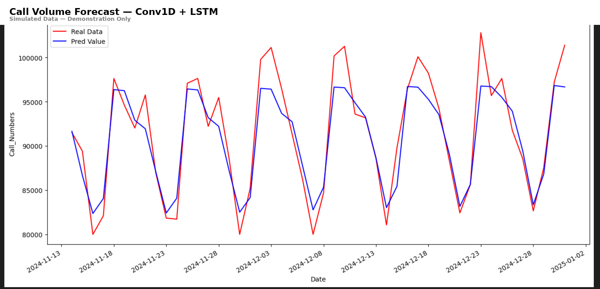

# Conv1D + LSTM Call Volume Forecasting

> 📌 This project was developed end-to-end by **Xichun Han** as a demonstration of time series forecasting with hybrid deep learning.  
> It is shared under the MIT License for educational purposes. If reused, **proper attribution is expected**.

---

## Overview

This project builds a deep learning pipeline to forecast daily inbound call volumes using a hybrid Conv1D + LSTM architecture. The code is structured for reproducibility using fully simulated data and mimics real-world capacity trends, holiday effects, and seasonal fluctuations.

Originally built to support staffing optimization at luxury travel company, this forecasting system reduced error by ~30% compared to Excel-based manual trendlines.

---

## Highlights

- **Model**: Conv1D layers for pattern extraction + LSTM layers for sequential memory
- **Features**: Simulated business metrics (`RollCap`, `monthly_sum`), U.S. holidays, and calendar signals
- **Optimization**: Hyperparameter tuning with `GridSearchCV` + `TimeSeriesSplit`
- **Stack**: TensorFlow/Keras, scikit-learn, pandas, holidays
- **Performance**: MAE ~0.0485 (scaled), significant uplift vs. baseline

---

## Repository Structure

```
├── generate_dummy_data.py
├── generate_monthly_sum_data.py
├── generate_rollcap_dummy_data.py
├── LSTM_CONV1D_Model.py
├── LSTM_CONV1D_Forecast.ipynb
├── requirements.txt
└── README.md
```

---

## Features

| Feature        | Description                                              |
|----------------|----------------------------------------------------------|
| `Total_Presented` | Target variable – daily inbound calls                 |
| `RollCap`      | 30-day rolling sum of projected capacity                 |
| `monthly_sum`  | Total calls in month – used as trend proxy               |
| `Holiday_A`    | Full-company closure (e.g., Christmas)                   |
| `Holiday_B`    | Reduced operation holidays (e.g., Labor Day)             |
| `weekday`, `week_number`, `month` | Calendar-based seasonality             |

---

## Model Architecture

- **Input**: `(7, 8)` sliding window of features
- **Conv1D Layers**: 64 & 32 filters (kernels 5 & 3), ReLU
- **LSTM Layers**: 3 stacked LSTMs with dropout & L2 regularization
- **Dense Layers**: 32-unit hidden layer + 1-unit output
- **Optimization**: Adam / Nadam, learning rate grid, batch size grid
- **Loss Function**: Mean Squared Error (MSE)
- **EarlyStopping**: Stops when training loss stagnates

---

## How to Run

```bash
# Step 1: Generate synthetic training + future data
python generate_dummy_data.py
python generate_monthly_sum_data.py
python generate_rollcap_dummy_data.py

# Step 2: Train and forecast
python LSTM_CONV1D_Model.py
```

Model outputs:
- Scaled and original-scale MAE/MSE
- Forecast plot vs historical
- Future prediction CSV (optional)

---

## Results

| Metric                | Value                         |
|-----------------------|-------------------------------|
| Scaled MAE            | ~0.0485                       |
| Original MAE Estimate | ~300–500 calls/day (approx.)  |
| Visual Forecast Match | Strong trend alignment across validation and future windows |

---

## Business Context

In real deployments, this architecture helped predict call demand across a 12-month horizon, accounting for cruise seasonality, promotional spikes, and U.S. holiday effects. It enabled more efficient scheduling, cost reduction, and faster decision-making in both sales and service departments.

---

## Author

**Xichun (Harrison) Han**  
AI & Data Strategy Manager @ Viking Cruises  
[LinkedIn](https://www.linkedin.com/in/xichun-han)

---

## 📈 Forecast Visualization

Below is a sample forecast from the Conv1D + LSTM model using simulated data.



*Forecast vs. Actual using dummy data (for architecture demonstration only)*

---

## License

MIT License. See `LICENSE` file for details.  
Use allowed for educational purposes. **Attribution is required for reuse.**

